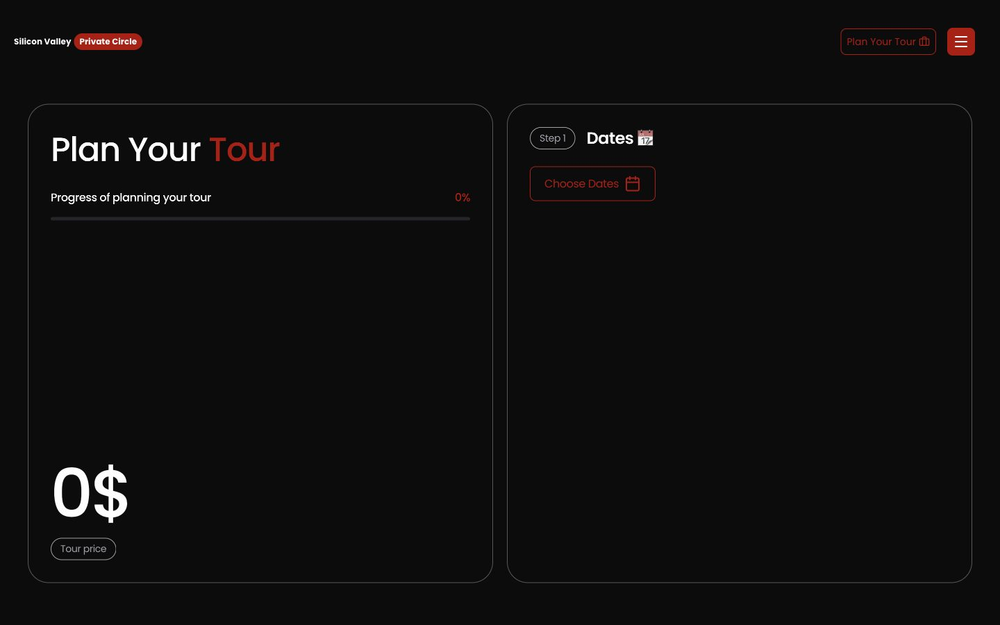

<div align="center">


Private Silicon Valley tours — planned in five steps, paid with Stripe.

**Next.js 16** · **React 19** · **Stripe** · **Tailwind CSS 4** · **Motion**


</div>

## Overview

Marketing site and booking flow for **Silicon Valley Private Circle**: private, door-to-door in the Bay Area.

Guests build a tour on [`/`](./src/app/page.tsx). The server recomputes the price, opens [Stripe](https://docs.stripe.com/payments/checkout), then confirms payment on return via a signed webhook.

| Surface | Route |
| --- | --- |
| Home (hero → planner) | [`/`](./src/app/page.tsx) |
| Legal | [`/privacy-policy`](./src/app/privacy-policy), [`/terms`](./src/app/terms), [`/sitemap`](./src/app/sitemap) |

## Tour planner



1. **Dates** — 1–14 days
2. **People** — solo, partners, family, or group (max 6)
3. **Attractions** — pick stops or let the guide choose
4. **Car** — Model 3, Model Y, Cybertruck, or ID. Buzz
5. **Contact** — email, phone, or Telegram

Pricing is derived from those answers (`$300` / day, `$25` lunch / person / day, vehicle, attraction tickets) and **recomputed on the server** at checkout. Wizard state is stored in `sessionStorage` so a Stripe redirect does not wipe the draft.

## Getting started

**Prerequisites:** [Node.js 24](https://nodejs.org) (see [`.nvmrc`](./.nvmrc)), [pnpm 12](https://pnpm.io), and the [Stripe CLI](https://docs.stripe.com/stripe-cli) for local webhooks.

```bash
pnpm install
cp .env.example .env.local
```

| Variable | Purpose |
| --- | --- |
| `STRIPE_SECRET_KEY` | Restricted secret key (`sk_test_…`) |
| `STRIPE_WEBHOOK_SECRET` | Signing secret from `pnpm stripe:listen` or the Dashboard |
| `NEXT_PUBLIC_APP_URL` | Absolute origin for Checkout return URLs (`http://localhost:3000` locally, `https://www.siliconvalleyprivatecircle.com` in production) |

```bash
pnpm stripe:listen   # leave running; copy the `whsec_…` into .env.local
pnpm dev             # http://localhost:3000
```

Restart the dev server after changing env vars. Pay with `4242 4242 4242 4242`, any future expiry, any CVC.

## Scripts

| Command | Description |
| --- | --- |
| `pnpm dev` | Development server |
| `pnpm build` | Production build |
| `pnpm start` | Serve the production build |
| `pnpm lint` / `pnpm lint:fix` | ESLint |
| `pnpm stripe:listen` | Forward Stripe events to `/api/webhooks/stripe` |
